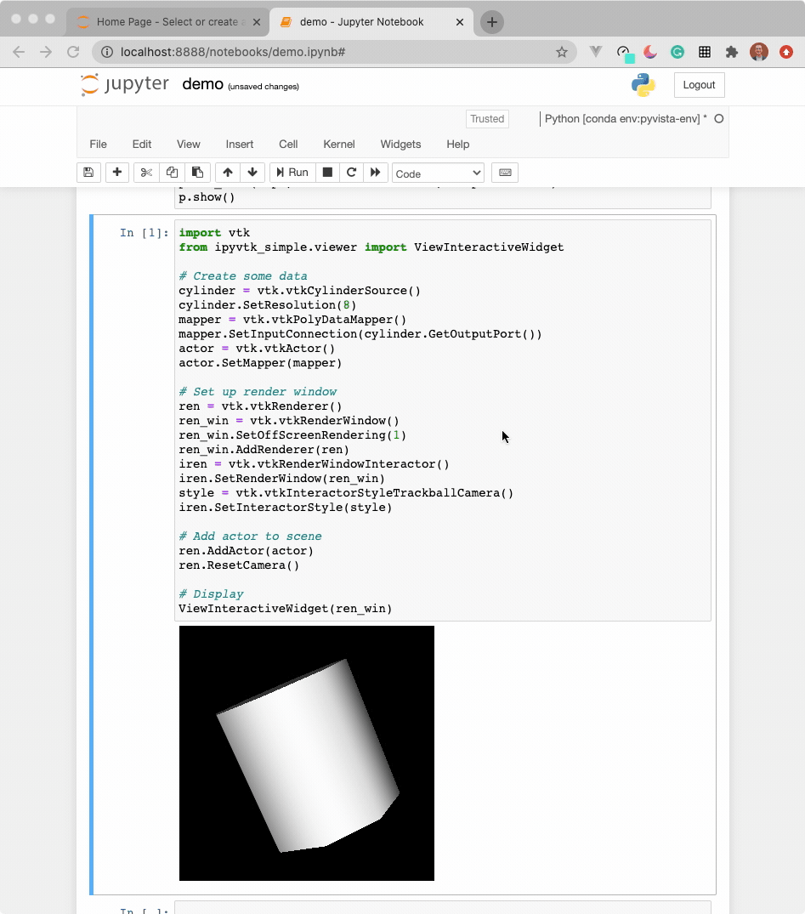

# ipyvtk_simple

[](https://mybinder.org/v2/gh/Kitware/ipyvtk-simple/master)

*An ipywidget for vtkRenderWindow*

This is an early prototype of creating a Jupyter interface to VTK. This toolkit
is a proof of concept and a more polished tool will be available as
[`ipyvtk`](https://github.com/Kitware/ipyvtk) in the future.

The code here was implemented from the work done by [Andras Lasso](https://github.com/lassoan)
under an MIT License (see [the source](https://github.com/Slicer/SlicerJupyter/blob/master/JupyterNotebooks/JupyterNotebooksLib/interactive_view_widget.py)).

The goal is to enable this widget to work with any server side
`vtkRenderWindow` - this render window could be from VTK Python, ParaView, or
PyVista. The current demo here subclasses PyVista's `Plotter` to utilize its
powerful and streamlined plotting API directly in a Jupyter environment.

## Run in Docker

To build and run in Docker:

```
docker build -t ipyvtk_simple .
docker run -p 8877:8877 ipyvtk_simple jupyter notebook --port=8877 --no-browser --ip=0.0.0.0 --allow-root
```


## Examples

You may have to build jupyter lab extensions for this to work in Lab. This is
known to worl well in Notebook.


### PyVista

We have created a `iPlotter` class that wraps PyVista's `Plotter` for quick use
of PyVista's plotting API:

```py
import pyvista as pv
from pyvista import examples

from ipyvtk_simple.plotter import iPlotter

mesh = examples.download_st_helens().warp_by_scalar()

plotter = iPlotter()
plotter.add_mesh_clip_plane(mesh)
plotter.show()
```


```py
volume = examples.download_knee_full()
opacity = [0, 0, 0, 0.1, 0.3, 0.6, 1]

plotter = iPlotter()
plotter.add_volume(volume, opacity=opacity)
plotter.show()
```


### Python VTK

The widget here can be used with VTK. Here is a minimal example showing how
to pass any `vtkRenderWindow` to the `ViewInteractiveWidget`:

```py
import vtk
from ipyvtk_simple.viewer import ViewInteractiveWidget

# Create some data
cylinder = vtk.vtkCylinderSource()
cylinder.SetResolution(8)
mapper = vtk.vtkPolyDataMapper()
mapper.SetInputConnection(cylinder.GetOutputPort())
actor = vtk.vtkActor()
actor.SetMapper(mapper)

# Set up render window
ren = vtk.vtkRenderer()
ren_win = vtk.vtkRenderWindow()
ren_win.SetOffScreenRendering(1)
ren_win.AddRenderer(ren)
iren = vtk.vtkRenderWindowInteractor()
iren.SetRenderWindow(ren_win)
style = vtk.vtkInteractorStyleTrackballCamera()
iren.SetInteractorStyle(style)

# Add actor to scene
ren.AddActor(actor)
ren.ResetCamera()

# Display
ViewInteractiveWidget(ren_win)
```


