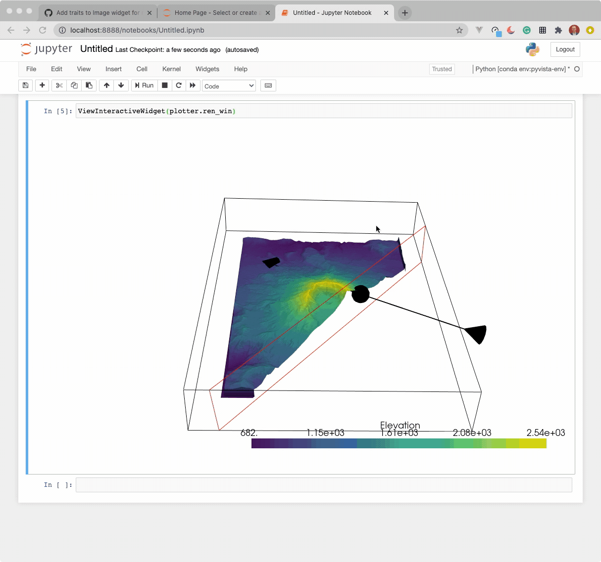

# ipyvtk

An ipywidget for vtkRenderWindow.

This is an early prototype implemented from the work done by Andras Lasso under
an MIT License (see [the source](https://github.com/Slicer/SlicerJupyter/blob/master/JupyterNotebooks/JupyterNotebooksLib/interactive_view_widget.py))


Example use (currently this only works in Jupyter Notebook):

```py
import pyvista as pv
import pyvistaqt as pvqt
from pyvista import examples

from ipyvtk.viewer import ViewInteractiveWidget

mesh = examples.download_st_helens().warp_by_scalar()

plotter = pvqt.BackgroundPlotter()
plotter.add_mesh_clip_plane(mesh)

ViewInteractiveWidget(plotter.ren_win)
```



