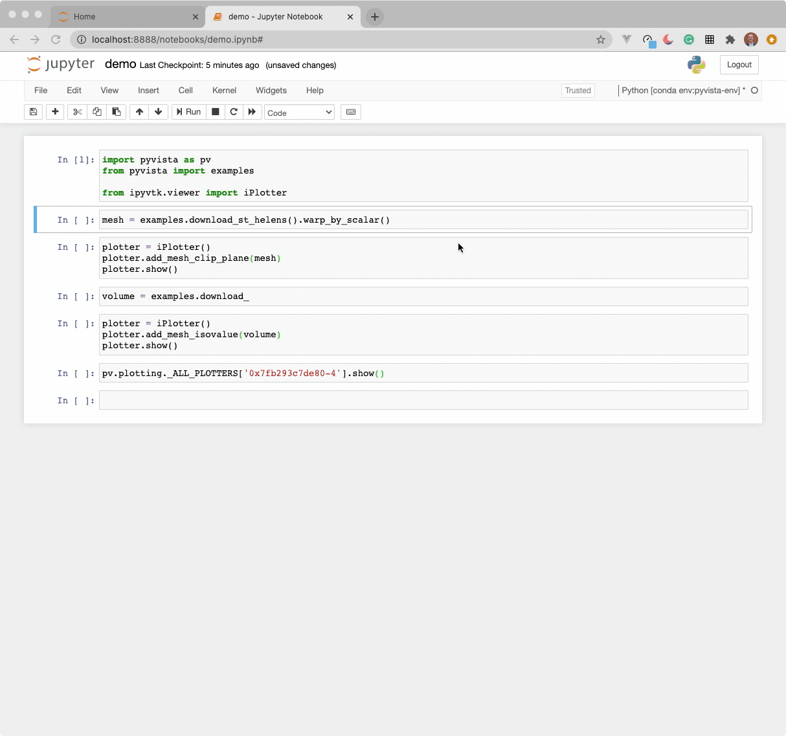

# ipyvtk-simple

[](https://mybinder.org/v2/gh/Kitware/ipyvtk-simple/master)

An ipywidget for vtkRenderWindow.

This is an early prototype implemented from the work done by Andras Lasso under
an MIT License (see [the source](https://github.com/Slicer/SlicerJupyter/blob/master/JupyterNotebooks/JupyterNotebooksLib/interactive_view_widget.py))


The goal is to enable this widget to work with any server side
`vtkRenderWindow` - this render window could be from VTK Python, ParaView, or
PyVista.

The current demo here subclasses PyVista's `Plotter` to create a plotting API
that can be imediately useable in Jupyter.

Example use (currently this only works in Jupyter Notebook, not Lab):

```py
import pyvista as pv
from pyvista import examples

from ipyvtk_simple.viewer import iPlotter

mesh = examples.download_st_helens().warp_by_scalar()

plotter = iPlotter()
plotter.add_mesh_clip_plane(mesh)
plotter.show()
```





```py
volume = examples.download_knee_full()
opacity = [0, 0, 0, 0.1, 0.3, 0.6, 1]

plotter = iPlotter()
plotter.add_volume(volume, opacity=opacity)
plotter.show()
```


## Run in Docker

```
docker build -t ipyvtk-simple .
docker run -p 8877:8877 ipyvtk-simple jupyter notebook --port=8877 --no-browser --ip=0.0.0.0 --allow-root
```
